# OpenChore 积分处理逻辑

本文档汇总 OpenChore 当前所有主要积分处理逻辑，包括完成、审批、Multiplier、类别门槛、逾期、漏做、撤销、家长代办、Excuse、FCFS、Streak、奖励、储蓄目标、积分衰减与手动调整。

## 目录

1. [名词和计算公式](#1-名词和计算公式)
2. [积分系统总图](#2-积分系统总图)
3. [完成 Chore 的完整流程](#3-完成-chore-的完整流程)
4. [Required、Core、Bonus 门槛](#4-requiredcorebonus-门槛)
5. [Due By、迟到与漏做 Penalty](#5-due-by迟到与漏做-penalty)
6. [定时漏做检查](#6-定时漏做检查)
7. [重复点击、撤销和重新完成](#7-重复点击撤销和重新完成)
8. [家长代为完成与 Excuse](#8-家长代为完成与-excuse)
9. [FCFS 多孩子抢单](#9-fcfs-多孩子抢单)
10. [Streak、奖励、目标和积分衰减](#10-streak奖励目标和积分衰减)
11. [10 分任务完整示例](#11-10-分任务完整示例)
12. [Point Log 类型索引](#12-point-log-类型索引)

## 1. 名词和计算公式

- `P`：Chore 基础积分，即 `points_value`。
- `M`：Schedule 积分倍数，即 `points_multiplier`，默认 `1`。
- `MP`：漏做扣分，即 Chore 的 `missed_penalty_value`。
- `LP`：迟到扣分，即 Schedule 的 `expiry_penalty_value`。
- 实际基础奖励：`截断取整(P × M)`。
- 当前余额：该用户所有 `point_transactions.amount` 的合计。

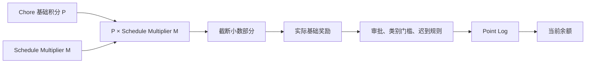

例如：

- `10 × 1 = 10`
- `10 × 1.5 = 15`
- `5 × 1.5 = 7.5`，当前数据库转换结果为 `7`

Multiplier 只影响完成奖励，不放大漏做扣分或迟到扣分。

## 2. 积分系统总图

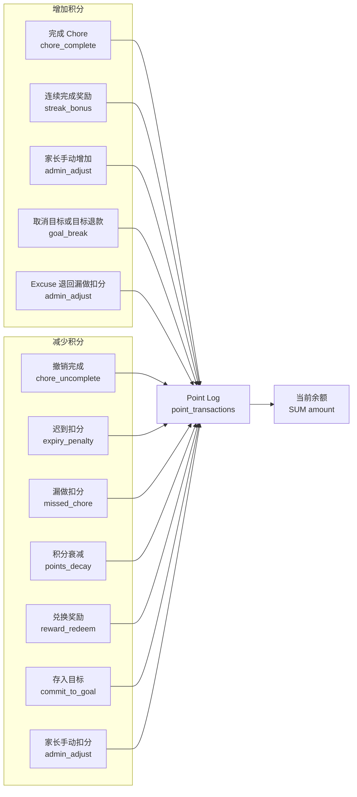

所有积分变化都通过 Point Log 表示，不直接维护一个可被任意覆盖的余额数字。

## 3. 完成 Chore 的完整流程

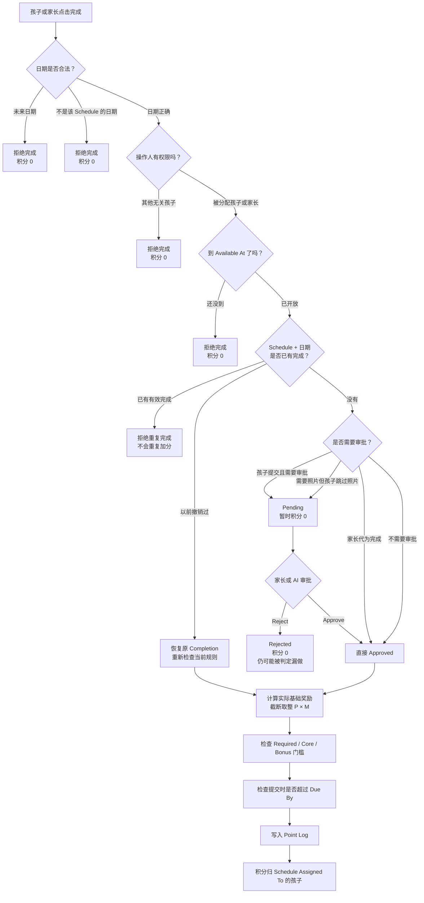

审批发生在几小时以后时，迟到判断使用原始 `completed_at`，不会使用家长批准时间。

## 4. Required、Core、Bonus 门槛

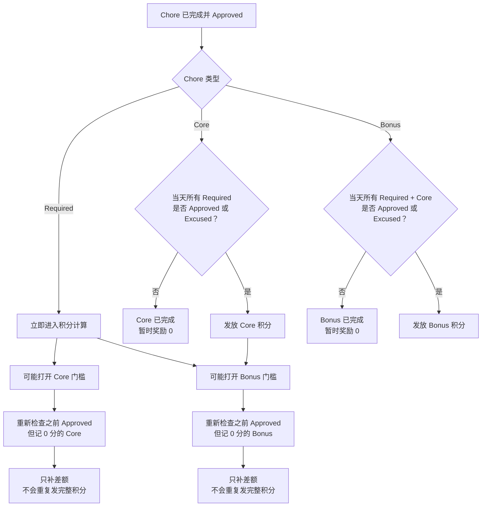

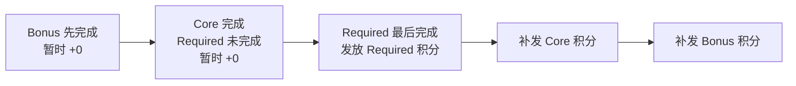

`Excused` 可以满足类别门槛，但 Excused 自己不会获得完成积分。

## 5. Due By、迟到与漏做 Penalty

假设：

- 基础积分 `P = 10`
- Multiplier `M = 1`
- 漏做 Penalty `MP = 5`
- 迟到扣分 `LP = 2`

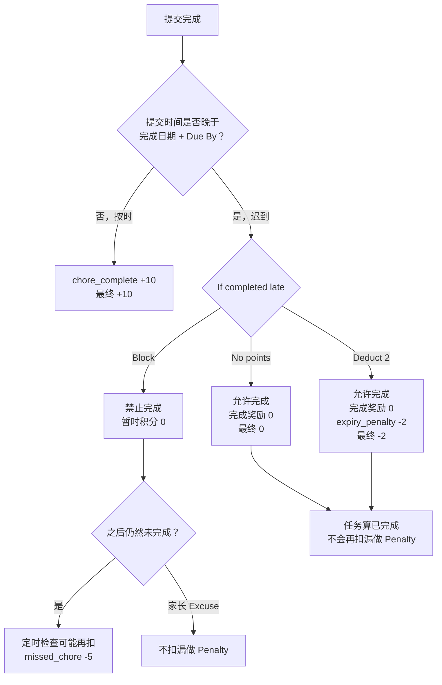

`Deduct points` 的定义：

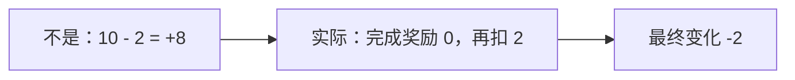

Multiplier 为 `1.5` 时：

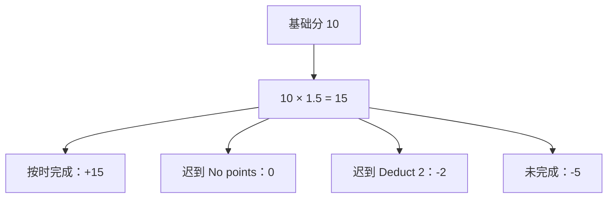

## 6. 定时漏做检查

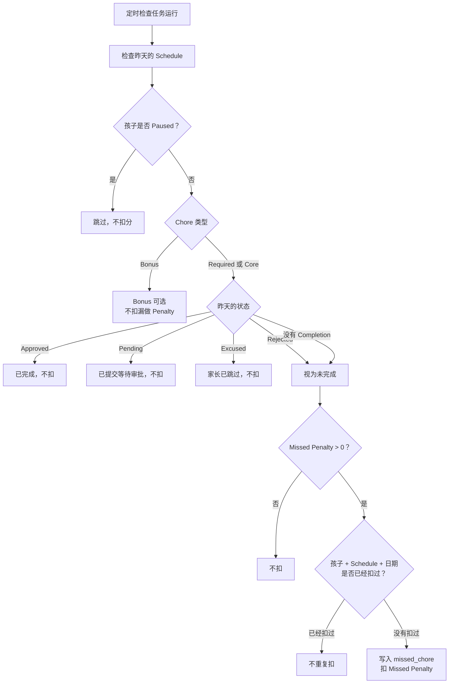

同一个用户、Schedule、日期具有唯一幂等键。即使定时任务重复执行，也只会扣一次。

## 7. 重复点击、撤销和重新完成

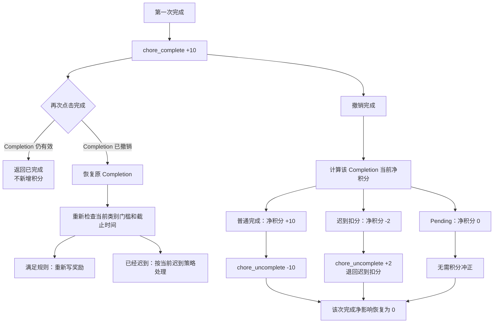

撤销接口是幂等的：连续撤销不会连续扣分。

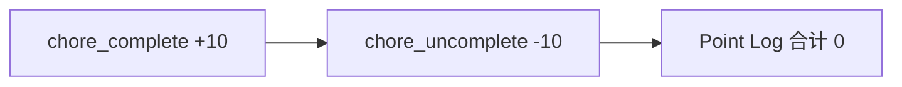

原日志不会被覆盖，撤销通过相反方向的新日志表达。

## 8. 家长代为完成与 Excuse

### 8.1 家长代为完成

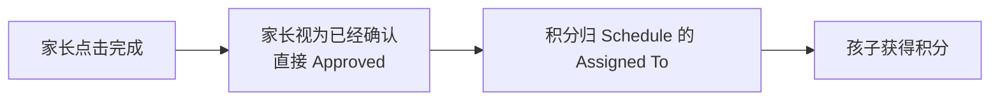

家长不能通过伪造 `completed_by` 把积分转给其他孩子。

### 8.2 家长 Excuse

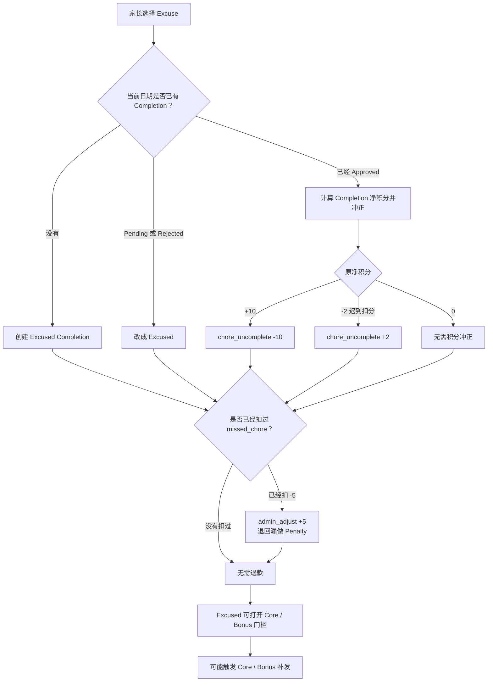

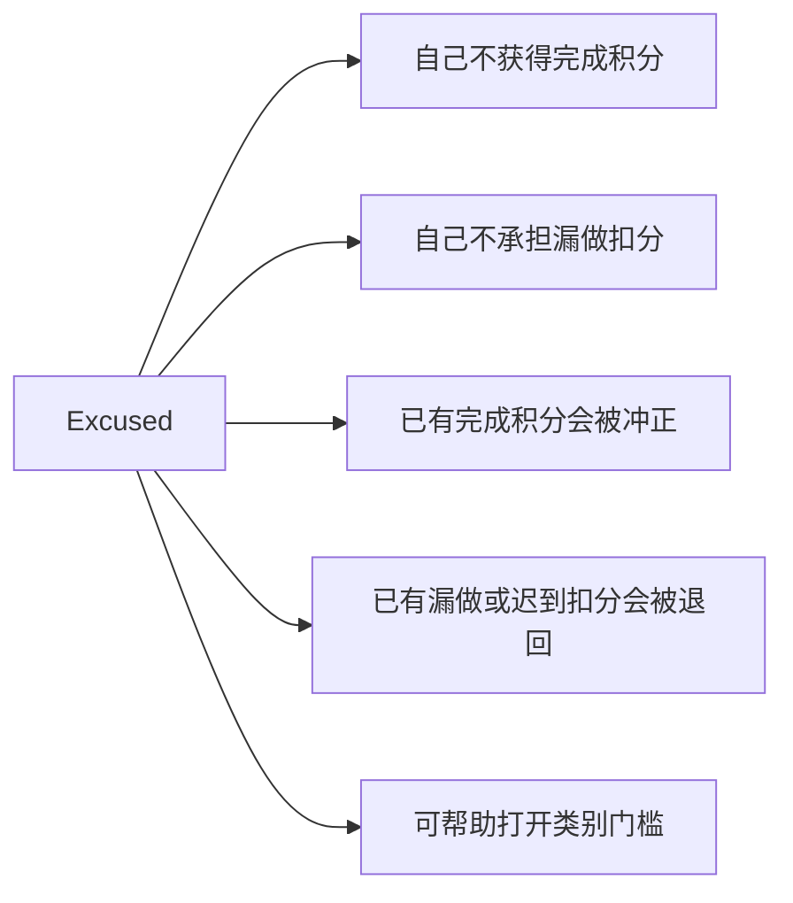

## 9. FCFS 多孩子抢单

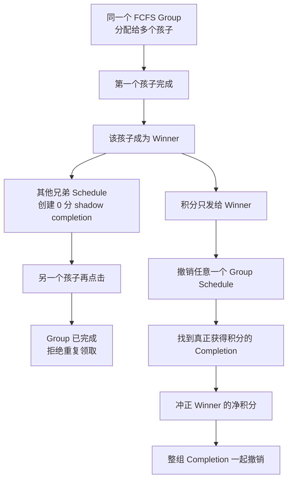

## 10. Streak、奖励、目标和积分衰减

### 10.1 Streak

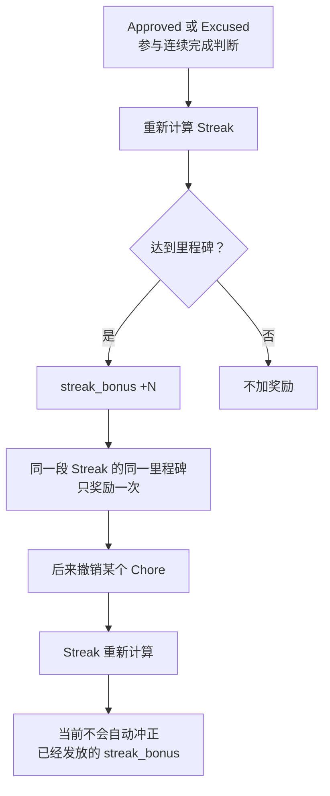

### 10.2 奖励兑换

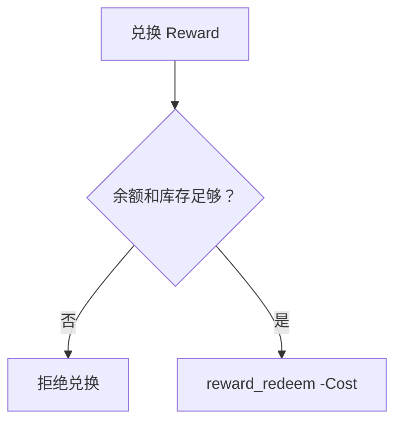

### 10.3 储蓄目标

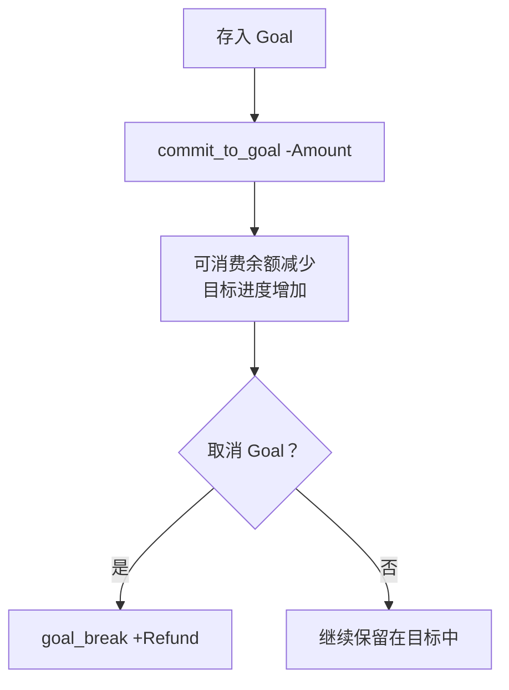

### 10.4 积分衰减

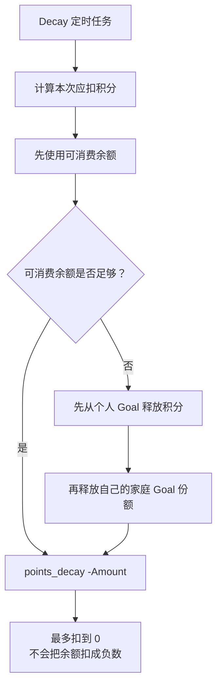

目标释放顺序：个人目标优先，然后是自己的家庭共享目标份额；同类目标中优先释放较新的目标。

### 10.5 家长手动调整

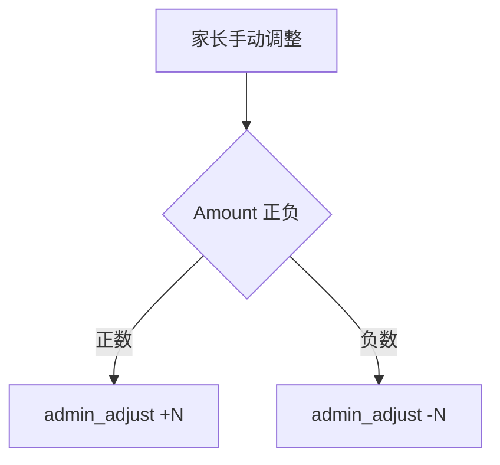

## 11. 10 分任务完整示例

参数：

```text
Points = 10
Multiplier = 1
Missed Penalty = 5
Late Deduct = 2
```

```mermaid
flowchart TD
    TASK["10 分 Chore"] --> SCENE{"发生什么？"}

    SCENE -- "按时 Approved" --> A["+10"]
    SCENE -- "Pending" --> B["0<br/>批准后再计算"]
    SCENE -- "Rejected" --> C["0<br/>之后可能漏做 -5"]
    SCENE -- "迟到 Block" --> D["不能完成<br/>之后可能漏做 -5"]
    SCENE -- "迟到 No points" --> E["完成成功<br/>0"]
    SCENE -- "迟到 Deduct 2" --> F["完成成功<br/>-2"]
    SCENE -- "一直未完成" --> G["定时检查<br/>-5"]
    SCENE -- "家长代完成" --> H["孩子 +10"]
    SCENE -- "家长 Excuse" --> I["0<br/>已有奖励或扣分全部冲正"]
    SCENE -- "完成后撤销" --> J["+10 再 -10<br/>合计 0"]
    SCENE -- "反复点击完成" --> K["只记第一次<br/>+10"]
    SCENE -- "Multiplier 1.5" --> L["按时 +15<br/>迟到仍为 0 或 -2"]
```

完整计算顺序：

```mermaid
flowchart LR
    BASE["计算完成奖励<br/>截断取整 Points × Multiplier"]
    BASE --> APPROVAL["检查审批状态"]
    APPROVAL --> GATE["检查类别门槛"]
    GATE --> LATE["应用迟到规则"]
    LATE --> LOG["写入 Point Log"]
    LOG --> BALANCE["所有日志求和得到余额"]
```

## 12. Point Log 类型索引

| Reason | 方向 | 用途 |
|---|---:|---|
| `chore_complete` | 正数或 0 | Chore 完成奖励或补发奖励 |
| `chore_uncomplete` | 正数或负数 | 撤销完成、冲正奖励或退回迟到扣分 |
| `streak_bonus` | 正数 | Streak 里程碑奖励 |
| `admin_adjust` | 正数或负数 | 家长手动调整、Excuse 退回漏做扣分 |
| `expiry_penalty` | 负数 | 迟到完成扣分 |
| `missed_chore` | 负数 | 定时任务发现 Required/Core 漏做 |
| `points_decay` | 负数 | 周期性积分衰减 |
| `reward_redeem` | 负数 | 兑换奖励 |
| `commit_to_goal` | 负数 | 把可消费积分存入目标 |
| `goal_break` | 正数 | 取消目标、释放目标积分或衰减回收 |

